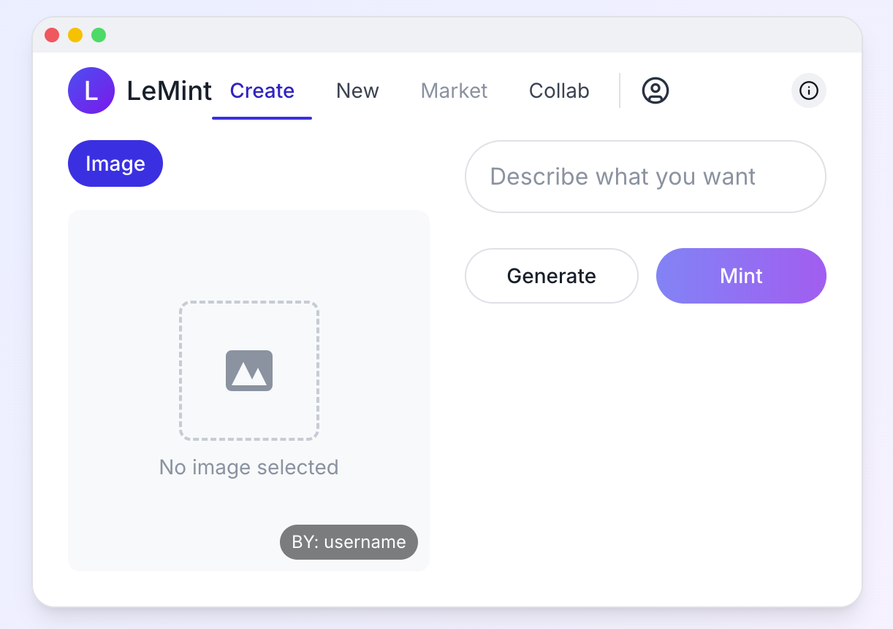
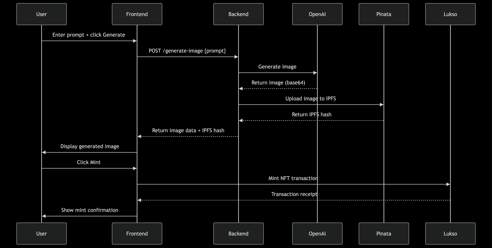

- Start server: `npm start`
- You can find the mini-app at: https://universaleverything.io/0x0385a63d12eb9B9e76451B057d347A3B0fD088e7?network=testnet&assetGroup=grid
- Frontend repo: [https://github.com/vigilvv/lemint-frontend-new](https://github.com/vigilvv/lemint-frontend-new)

- Smart contracts repo: [https://github.com/vigilvv/lemint-lukso-contracts](https://github.com/vigilvv/lemint-lukso-contracts)
- Main entrypoint: `src/server.ts`

# LeMint Architecture and System Documentation

## System Overview

LeMint is an AI-powered NFT minting platform on the Lukso blockchain that allows users to:

1. Generate unique AI images based on text prompts
2. Save those images to IPFS via Pinata
3. Mint them as NFTs on the Lukso blockchain

The system consists of:

* Frontend React application (shown in the screenshot)
* Backend Node.js/Express API service
* OpenAI for image generation
* Pinata for IPFS storage
* Lukso blockchain for NFT minting

## Sequence Diagram

## Detailed System Description

### 1. Frontend Layer

* Provides UI for users to enter prompts and view generated images
* Handles UP provider for Lukso blockchain
* Displays minting status and transaction confirmations
* Communicates with backend via REST API

### 2. Backend API Layer (Node.js/Express)

* **Routes** :
  * `/generate-image`: Handles image generation requests
  * `/save-to-ipfs`: Test endpoint for IPFS uploads
  * `/mint`: Handle NFT minting, uploads to ipfs, and setting LSP4 metadata
* **Services** :
  * `openai.service.ts`: Interfaces with OpenAI's image generation API
    * Uses GPT-image model
    * Returns base64 encoded images
  * `pinata.service.ts`: Manages IPFS uploads via Pinata
    * Handles both image and metadata uploads
    * Returns IPFS hashes and gateway URLs

### 3. External Services Integration

 **OpenAI Integration** :

* Uses the latest image generation models
* Accepts text prompts and returns high-quality images
* Handles rate limiting and error cases

 **Pinata/IPFS Integration** :

* Provides reliable IPFS pinning service
* Stores both images and metadata
* Returns content-addressable IPFS hashes

 **Lukso Blockchain** :

* Handles contract deployment and NFT minting
* Uses LUKSO's Universal Profiles and LSP8 NFT standards

### 4. Data Flow

1. **Image Generation** :

* User enters prompt → Frontend → Backend → OpenAI
* OpenAI generates image → Backend → Frontend → User

2. **IPFS Storage** :

* Generated image → Backend → Pinata/IPFS
* IPFS hash stored for NFT metadata

3. **NFT Minting**:

* Frontend initiates minting transaction
* User sends recipient address (auto extracted with up-provider)
* Transaction sent to Lukso blockchain
* NFT created with IPFS metadata

### 5. Error Handling

* API error handling for OpenAI/Pinata
* Transaction monitoring for blockchain ops
* User-friendly error messages

### 6. Security Considerations

* API key management via environment variables
* IPFS content addressing ensures immutability

## Future Enhancements

1. Collection creation features
2. Royalty configuration
3. Support music and video NFTs
4. "New" section that displays all newly created NFTs
5. Leaderboard
6. "Collab" to allow remixing NFTs≈
